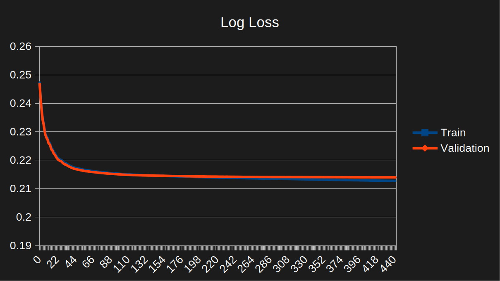
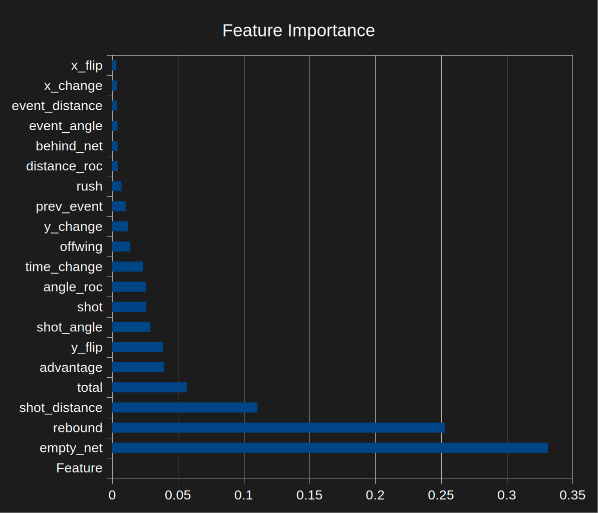

# Contents
- [Introduction](#introduction)
- [Article](#article)
  - [The Bold Claim](#the-bold-claim)
  - [Feature Dictionary](#feature-dictionary)
  - [Model Pipeline](#model-pipeline)
  - [Training Results](#training-results)
- [Developers](#developers)
  - [Requirements](#requirements)
  - [Getting Started](#getting-started)
  - [Short Instructions](#short-instructions)

# Introduction
Welcome to the [hockeyanalytica.com](https://hockeyanalytica.com/) open-source Expected Goals (xG) model! For general readers, this document includes an article dedicated to how we built our xGoals model, what we learned, and how it performed. For developers looking to experiment with our model, there is a developers segment at the end which documents what you need to work with our repository. Input from both general readers and developers is welcomed!

# Article
Expected Goals (xGoals) calculates the probability of any given shot resulting in a goal. Typically, this statistic is referenced for assessing shot quality and a player/team's ability to generate scoring chances. However, it is our opinion that many models have shifted their focus away from shot-quality and toward raw goal probability. Admittedly, this statement sounds contradictory, but please allow us to explain before brushing off our claim. Keep in mind we are not trying to argue that our theory is correct. The purpose of this article is to open discussion about xGoals in case our theory is correct.

## The Bold Claim
The main value in xGoals is that it helps us evaluate shot quality. We theorize that shot quality is being misrepresented by xGoals models using features unrelated to shot quality. Some such features we have identified to (maybe) distort shot quality include the period, remaining time, home/away identifiers, and score states. These features certainly affect the probability of a shot being a goal, which is why they help models match actual goals scored more closely. But xGoals is not supposed to be an exact match to actual goals scored—that would be redundant. The true value of xGoals is that it tells us the quality of any given shot—even if the shot quality contradicts the actual outcome.

This idea has prompted us to ask some very important questions that we hope will get the hockey stats community thinking:
* How can we prove or disprove that there is a difference between features that are better for goal probability vs shot quality in xGoals models?
* If such a difference is proven to exist, how do we distinguish features that accurately represent shot quality in xGoals models from features that misrepresent shot quality?
* If goal probability is the sole determining factor for shot quality, how can any feature that affects goal probability misrepresent shot quality?
* Do any of the features we identified as misrepresentative of shot quality actually act as proxies for factors that do affect shot quality? Such as strategy changes based on score state that may alter shot quality.
* If these features are indeed proxies, is there still a risk of misrepresentation of shot quality?

Perhaps these questions have already been answered, or perhaps we are the first ones to ask such questions. Regardless, we want to ensure that our xGoals model is optimized to accurately represent shot quality, so we stuck with a conservative feature set that we believe represents our theory well.

## Feature Dictionary
We have selected 20 features for our first xGoals model, all of which we feel have a real impact on shot quality. During our testing, we have experimented with all sorts of approaches: one model per situation, models for different groupings of situations, and we even ventured into the darkness of the dreaded "one model to rule them all" approach. Throughout all these methods, we used the same 20 features for the training of all our models. Yes... even our model for empty-net-only situations used the empty net indicator during training. Fortunately, XGBoost is good at identifying features that fail to provide any value, and it reliably removes them from having any impact on the model.

| Feature        | Description |
|----------------|-------------|
| Advantage      | The number of skaters the shooting team has compared to defending team. Positive values mean there were x skaters greater than the defending team (power-play). Negative values mean there were x skaters less than the defending team (short-handed). |
| Angle RoC      | Finds the angle between a shot and its previous event, and divides that angle by the time taken between both events. |
| Behind Net     | Indicates if a shot was behind the net. |
| Distance RoC   | Finds the distance between a shot and its previous event, and divides that distance by the time taken between both events. |
| Empty Net      | Indicates if a shot was on an empty net. |
| Event Angle    | The angle between a shot and its previous event. |
| Event Distance | The distance between a shot and its previous event. |
| Offwing        | If the shooter was on their offwing. |
| Prev Event     | The type of event that occurred before a shot. |
| Rebound        | If a shot came on a rebound opportunity. Rebounds in this model are defined as any shot that came within 3 seconds of a previous shot attempt. |
| Rush           | If a shot came on a rush opportunity. Rush attempts in this model are defined as any shot that came within 3 seconds of an event from the neutral zone, or any shot that came within 5 seconds of an event from the defensive zone. |
| Shot           | The type of shot. |
| Shot Angle     | The angle of a shot relative to the center of the goal. A shot directly on the line between the center faceoff dot and the center of the goal has a 0 degree angle. A shot from the goal line has a 90 degree angle. |
| Shot Distance  | Distance between a shot and the center of the goal. |
| Time Change    | Difference in time between a shot and its previous event. |
| Total          | The total number of skaters on the ice. 5v5 = 10 skaters, 5v4 = 9 skaters, 3v3 = 6 skaters, etc. |
| X Change       | The length-wise difference between a shot and its previous event. |
| X Flip         | If a shot and its previous event were on opposite sides of the goal line. |
| Y Change       | The width-wise difference between a shot and its previous event. |
| Y Flip         | If a shot and its previous event crossed the vector between both goals. |

## Model Pipeline
In case you missed it from earlier, for our model we used the xGoals gold standard: XGBoost—we love how fitting that name is. Our pipeline is pretty basic, the main thing worth noting is that our data is split into four sets: 60% train, 15% for both validation and calibration, then 10% for our test set. Four splits seem a bit odd but it was necessary to avoid leakage of the test set data into our model during its calibration, so we added a dedicated calibration set. XGBoost can push probabilities toward the extremes, so calibration is necessary to ensure that these probabilities are pulled back to more realistic values.

The only other thing worth mentioning is that our pipeline can be pretty flexible when defining our scope of data to use for training. We can tell it to train one model for all situations or train situation-specific models, and we can tell it to use our full history of samples or to favor more recent samples. We narrowed things down to two approaches: all situations in one model, and three models split between full strength situations, special teams, and empty net situations.

## Training Results
Before we present our results, we want to set expectations by stating that our results are likely to look less appealing than some of the more reputable models that already exist. But this is expected since we have limited our feature set to exclude features that may favor goal probability over shot quality. We are going to keep our results concise by showing the results of only our best performing model.

Surprisingly, we found the best results came from one model for all situations and seasons. Perhaps there really should be "one model to rule them all." We added a few features to help the model distinguish different game situations—such as the shooting team's advantage, total skaters on the ice, and empty net status—so we feel confident that our model could accurately adjust for those changes in gameplay. One area for improvement is that all seasons were weighted equally, so there is a risk that seasons with API or rule changes affecting shot quality are misrepresented.

We can see from the below graph that our model's training and validation loss converged closely and consistently, differing by just 0.003 log loss on the 358th iteration: 

When testing the model on our test set, it achieved a `0.21468 Log Loss`, and a `0.78206 AUC`—which are the results we expect based on the training and validation set results. We also feel that this shows our model is competitive with some of the more reputable models that exist at the time of this writing, especially when we consider the limitations we placed on our feature set.

As for our feature importances, we see the same pattern as many other models. Empty nets, rebounds, and shot distance are our most important features. We also noticed that the model found the count of total skaters on the ice to be the fourth most important feature, which suggests it appropriately adjusts for the diversity in strengths. If you need a reference as to what each feature means, please reference our [Feature Dictionary](#feature-dictionary) that was presented earlier. 

Finally, we will present the seasonal results of our model. Unfortunately, these metrics were not exclusively calculated on our test set because our database has no way to identify what records were from what set. But since our model converged nicely, we expect the results to be similar if we had a way to reduce the scope to just the test set. We define `difference` as the number of xGoals greater than or less than actual goals. Whereas `calibration` represents the percent of xGoals greater than or less than actual goals. Here are the results of all situations across each season. We will go through what we found and areas for improvement afterward. Log Loss and AUC are our main concerns here, calibration is somewhat useful but should be considered less important since we expect shot quality to be different from actual goals scored.

**All Strengths:**
| Season | Difference | Calibration | Log Loss | AUC |
|--------|------------|-------------|----------|-----|
|20252026| 247.78     | 2.81        | 0.237    |0.756|
|20242025| -156.46    | -1.82       | 0.227    |0.768|
|20232024| -6.37      | -0.07       | 0.224    |0.77 |
|20222023| 90.39      | 1           | 0.232    |0.763|
|20212022| -71.99     | -0.81       | 0.223    |0.767|
|20202021| -164.23    | -2.91       | 0.218    |0.781|
|20192020| -83.91     | -1.14       | 0.218    |0.778|
|20182019| -433.02    | -5.25       | 0.219    |0.774|
|20172018| -289.71    | -3.54       | 0.218    |0.775|
|20162017| -48.57     | -0.66       | 0.216    |0.779|
|20152016| 28.17      | 0.39        | 0.213    |0.782|
|20142015| 0.68       | 0.01        | 0.208    |0.778|
|20132014| -45.22     | -0.6        | 0.21     |0.779|
|20122013| -78.69     | -1.76       | 0.209    |0.777|
|20112012| -32.02     | -0.43       | 0.207    |0.784|
|20102011| 14.99      | 0.2         | 0.216    |0.778|

**Full Strength (5v5 with both goalies) Results:**
| Season | Difference | Calibration | Log Loss | AUC |
|--------|------------|-------------|----------|-----|
|20252026| 9.26       | 0.16        | 0.21     |0.752|
|20242025| -94.87     | -1.7        | 0.2      |0.762|
|20232024| -57.09     | -1.01       | 0.199    |0.768|
|20222023| 129.3      | 2.23        | 0.207    |0.757|
|20212022| -34.16     | -0.58       | 0.201    |0.76 |
|20202021| -50.13     | -1.36       | 0.194    |0.777|
|20192020| -32.88     | -0.69       | 0.195    |0.774|
|20182019| -207.84    | -3.84       | 0.192    |0.771|
|20172018| -100.03    | -1.92       | 0.192    |0.768|
|20162017| 29.41      | 0.61        | 0.194    |0.774|
|20152016| 106.12     | 2.32        | 0.19     |0.775|
|20142015| -21.63     | -0.46       | 0.185    |0.77 |
|20132014| -56.41     | -1.19       | 0.188    |0.77 |
|20122013| -12.4      | -0.43       | 0.187    |0.768|
|20112012| -7.09      | -0.15       | 0.186    |0.775|
|20102011| -4.53      | -0.1        | 0.187    |0.776|

**Special Teams (all strengths except full strength and empty net) Results:**
| Season | Difference | Calibration | Log Loss | AUC |
|--------|------------|-------------|----------|-----|
|20252026| 205.06     | 7.84        | 0.31     |0.693|
|20242025| -48.84     | -1.98       | 0.31     |0.698|
|20232024| 68.28      | 2.58        | 0.298    |0.706|
|20222023| -24.73     | -0.9        | 0.303    |0.711|
|20212022| 2.25       | 0.09        | 0.291    |0.713|
|20202021| -89.71     | -5.42       | 0.29     |0.727|
|20192020| -64.39     | -2.9        | 0.282    |0.732|
|20182019| -191.98    | -7.98       | 0.302    |0.712|
|20172018| -164.31    | -6.35       | 0.301    |0.729|
|20162017| -62.75     | -2.75       | 0.289    |0.73 |
|20152016| -47.76     | -2.06       | 0.283    |0.735|
|20142015| 30.4       | 1.29        | 0.275    |0.746|
|20132014| 7.2        | 0.29        | 0.272    |0.751|
|20122013| -53.31     | -3.66       | 0.278    |0.749|
|20112012| 0.81       | 0.03        | 0.268    |0.761|
|20102011| 19.38      | 0.76        | 0.275    |0.742|

**Empty Net (all strengths shooting on an empty net) Results:**
| Season | Difference | Calibration | Log Loss | AUC |
|--------|------------|-------------|----------|-----|
|20252026| 33.47      | 6.13        | 0.789    |0.729|
|20242025| -12.74     | -2.24       | 0.725    |0.658|
|20232024| -17.56     | -3.62       | 0.742    |0.683|
|20222023| -14.18     | -3.06       | 0.749    |0.677|
|20212022| -40.08     | -7.71       | 0.655    |0.622|
|20202021| -24.39     | -8.35       | 0.91     |0.582|
|20192020| 13.37      | 3.75        | 0.844    |0.61 |
|20182019| -33.2      | -7.56       | 0.877    |0.616|
|20172018| -25.37     | -6.57       | 0.617    |0.567|
|20162017| -15.24     | -4.85       | 0.584    |0.629|
|20152016| -30.19     | -7.64       | 0.583    |0.632|
|20142015| -8.09      | -2.56       | 0.679    |0.573|
|20132014| 4.99       | 2.01        | 0.599    |0.635|
|20122013| -12.98     | -8.83       | 0.573    |0.64 |
|20112012| -25.73     | -10.05      | 0.595    |0.598|
|20102011| 0.14       | 0.06        | 0.603    |0.597|

Unfortunately, we see a possible pattern that the best results are coming from older seasons, and recent seasons seem to be less reliable. This tells us we should train a separate model that favors samples from recent seasons over older ones and update our xGoals for recent seasons using that model. Our model performs best at full strength, and worst at empty net situations. However, since special teams make up so many more shots than empty net situations, we should focus our attention on improving our special teams results. There is plenty of room for improvement. But for our first xGoals model, we think these are acceptable results. We will be making improvements that are beyond the scope of this article, with a prioritization on enhancing our model for recent seasons.

Notably, this model that is built purely on shot-intrinsic features may also serve as a baseline for testing our [Bold Claim](#the-bold-claim). A natural next step would be to train a comparison model that includes our excluded features, and use both models to test if shot quality really can be misrepresented by our excluded features. Thank you for reading, and please let us know what you think at connect@hockeyanalytica.com.

# Developers
This repository is (mostly) a copy + paste of the actual code used by the server running [hockeyanalytica.com](https://hockeyanalytica.com/). Irrelevant directories and files have been removed and modifications have been made to potentially sensitive information, but everything used for our xGoals model is an exact copy.

If you prefer instant gratification or are eager to start, you can skip to the [Short Instructions](#short-instructions) segment.

## Requirements
The only requirements for this repository are `Docker`, which can be installed on your machine from [https://docs.docker.com/get-started/get-docker/](https://docs.docker.com/get-started/get-docker/), and `Git LFS` (for the data) from [https://git-lfs.com/](https://git-lfs.com/). If you are not using linux, you may need to change the image used inside the [Dockerfile](backend/Dockerfile) to avoid errors.

```bash
# Docker Installation Command (Linux)
sudo curl -fsSL https://get.docker.com | sh

# Git LFS Installation Command (Any)
git lfs install

# Clone Repository
git clone https://github.com/hockey-analytica/xgoals.git
```

## Getting Started
This repository has two parts: a [Database](database/) to store our data, and a [Backend](backend/) for processing that data. Because the backend performs all the data processing, we will prioritize our understanding of the backend. Docker is simply used to run and manage both the database and backend services.

| Service  | Runtime   | Description |
|----------|-----------|-------------|
| Docker   | Permanent | Separates runtime environments for both our database and backend. |
| Database | Permanent | Stores our data for the xGoals model. Extra data is included for those looking to experiment with more features! |
| Backend  | Temporary | Processes our data for both model training and model inference. Stops immediately once its shell session is exited. |

To begin experimenting we must use docker to start our database, insert data into our database, then start running commands inside the backend's shell. The below commands can be used to do all this. Note that linux users may need to use `sudo` for all docker commands.

```bash
# Starts the Database
docker compose up -d

# Inserts Data into the Database
docker compose exec -T database pg_restore -U postgres -d database < data.dump

# Starts the Backend in an Active Shell (Closes Only When Exited)
docker compose run --rm backend sh

# Runs Backend Commands in a Detatched Shell (Closes When Command Completes)
docker compose run -d --rm backend sh -c "<command>"
```

To start training or making inferences, we need to use the [train](backend/train.py) and [main](backend/main.py) modules from inside the backend's shell as shown below. It is worth noting that the command line supports any model as an input. However, xgoals is currently the only existing model.

```bash
# Trains a Model
python -m train model

# Makes Inferences using a Trained Model
python -m main model
```

Both the [train](backend/train.py) and [main](backend/main.py) modules support inputs. In fact, xGoals already accepts parameters as shown below. Excluding any of the input parameters will result in their default values being used.

```bash
# Training
python -m train xgoals '{"type": "string", "scale": float, "decay": float}'

# Inference
python -m main xgoals '{"type": "string"}'
```

| Parameter | Values | Description |
|-----------|--------|-------------|
| type      | None   | Sets the models scope to all strengths/situations/types. None is the default. |
| type      | "fs"   | Sets the models scope to 5 on 5 situations with both goalies. |
| type      | "st"   | Sets the models scope to all situations except full strength and empty net situations. |
| type      | "en"   | Sets the models scope to only empty net situations. |
| scale     | 1+     | Weights imbalanced classes so the occurances of the minority class more closely matches the occurances of the majority class. Scale of 1 means keep the natural distribution of classes. 1 is the default. |
| decay     | 0-1    | Determines the decay rate of samples pulled from later seasons. Decay of 1 means all samples of all seasons are used for training. Lower decay rates means older seasons are exponentially smaller. 1 is the default. |

The [config.json](backend/config.json) file is used to set each model's configurations, including the SQL query used to source data for the model. All transformations for the model's data are done inside this SQL query. To examine or modify the features used in our model, find the `query` key for `xgoals` inside [config.json](backend/config.json).

The logic used for our training and inference pipelines can be found inside [xgoals.py](backend/nhl/xgoals.py). To add new models, one can simply append a new configuration inside [config.json](backend/config.json), add a new file `./backend/nhl/model.py` with the model's pipeline logic, and import that file inside [init.py](backend/nhl/__init__.py).

You should run `truncate public.logs` on the database between each new round of inferences to ensure all xgoals values are overwritten in the database. Training is unaffected by the logs table. The logs table is included so developers can verify that generating inferences succeeded.

You can use the [evaluation.sql](evaluation.sql) script to observe the evaluation metrics of the inference data. This is the same script we used for evaluating our model results.

## Short Instructions
### Install Docker and Git LFS
`Docker` installation can be found at [https://docs.docker.com/get-started/get-docker/](https://docs.docker.com/get-started/get-docker/). `Git LFS` installation can be found at [https://git-lfs.com/](https://git-lfs.com/).

```bash
# Docker Installation Command (Linux)
sudo curl -fsSL https://get.docker.com | sh

# Git LFS Installation Command (Any)
git lfs install
```

### Setup Database
```bash
# Starts the Database
docker compose up -d

# Inserts Data into the Database
docker compose exec -T database pg_restore -U postgres -d database < data.dump
```

### Start Backend
```bash
docker compose run --rm backend sh
```

### Train and Infer
```bash
# Trains a Model
python -m train xgoals

# Makes Inferences using a Trained Model
python -m main xgoals
```
